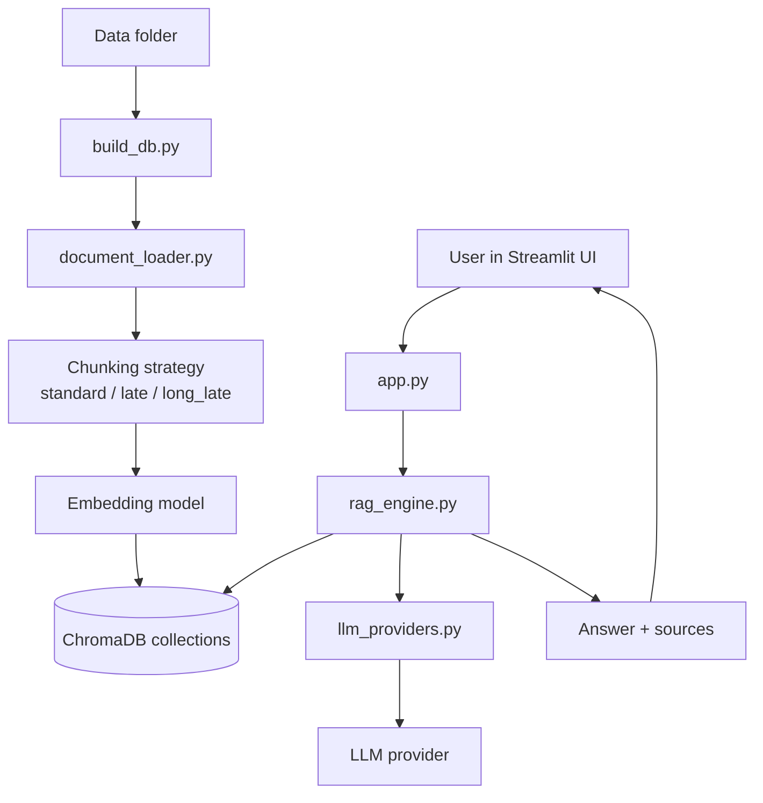

# ChatbotPTCTPT - Project Documentation

Tai lieu nay tong hop toan bo thong tin van hanh, phat trien, mo rong va deploy cua du an.
No duoc viet de dev co the onboard nhanh va giam do lech giua code va docs.

## 1. Tong quan

ChatbotPTCTPT la he thong RAG (Retrieval-Augmented Generation) tu van ve Phat trien Chuong trinh Giao duc Pho thong.
He thong truy xuat noi dung tu tai lieu noi bo va tai lieu quy pham, sau do tao cau tra loi co trich dan nguon.

Muc tieu chinh:
- Cung cap cau tra loi co can cu (citation-based answer)
- Tach rieng indexing va inferencing de de van hanh
- Ho tro nhieu provider LLM
- Ho tro nhieu chien luoc embedding/chunking de AB test chat luong

## 2. Mien quyet dinh ky thuat

- UI: Streamlit
- Retrieval storage: ChromaDB
- Embedding local: HuggingFace sentence transformers
- LLM gateway: LangChain wrappers cho Groq, OpenAI, Anthropic, Google, DeepSeek
- Ingestion: LangChain loaders cho PDF, Office, text, csv, html

## 3. Kien truc tong the

## 4. Cau truc thu muc

- app.py: giao dien Streamlit va luong hoi dap
- src/config.py: cau hinh tap trung (paths, providers, chunking, retrieval)
- src/llm_providers.py: factory khoi tao LLM theo provider
- src/document_loader.py: load tai lieu, chunk, metadata
- src/late_chunking.py: token-level embedding cho late/long_late
- src/build_db.py: CLI build va quan ly collections
- src/rag_engine.py: retrieval + prompt + generation
- data/: du lieu nguon index
- chroma_db/: vector database va registry file
- scripts/: script build/deploy/git workflow
- docs/: tai lieu du an

## 5. Luong chay chi tiet

### 5.1 Luong indexing

1. Quet file hop le trong data/
2. Doc noi dung theo ext loader
3. Tao chunk theo chunk variant
4. Neu standard: embed tung chunk
5. Neu late/long_late: embed theo token cua full text roi pool theo span chunk
6. Ghi vao collection ChromaDB theo quy tac ten collection
7. Cap nhat registry indexed_files__<collection>.json

### 5.2 Luong inference

1. User chon provider, model, embedding alias, chunk variant, strategy
2. App xac dinh collection dang co trong DB
3. Tao retriever theo mode similarity/mmr/score_threshold
4. Apply category filter theo nguon (FPT / Bo GD)
5. Lay context tu ChromaDB
6. Day context vao prompt he thong
7. Goi LLM va tra ket qua + danh sach source duy nhat

## 6. Collection naming va matrix AB test

Ten collection:

embed_alias__chunk_variant__chunking_strategy

Vi du:
- minilm__coarse__standard
- mpnet__balanced__late
- bge_m3__fine__long_late

Loi ich:
- Co the AB test retrieval quality ma khong ghi de du lieu cu
- UI chi cho phep chon cac combo da build
- De rollback cau hinh retrieval

## 7. Cau hinh trong src/config.py

Nhom cau hinh quan trong:
- Duong dan: PROJECT_ROOT, DATA_DIR, CHROMA_DIR, DOCS_DIR
- Embeddings: EMBED_MODELS, DEFAULT_EMBED_ALIAS
- Chunk variants:
  - fine: 256/128
  - balanced: 800/200
  - coarse: 1000/150
- Chunking strategies: standard, late, long_late
- Retrieval: DEFAULT_TOP_K, SEARCH_TYPES, fetch_k, lambda_mult, score_threshold
- Providers: danh sach model va env key cho tung nha cung cap
- Source categories:
  - QD -> FPT
  - TT32_2018 -> Bo GD

## 8. Metadata schema cho moi chunk

Document metadata duoc chuan hoa trong document_loader:
- document_name
- file_name
- file_path
- file_type
- file_size_kb
- source_url
- raw_url
- page_number
- chunk_index
- total_chunks
- indexed_at
- category
- language
- char_count

Y nghia:
- source_url/raw_url dung de trich dan va tai file
- category dung de filter retrieval
- chunk_index/page_number dung de debug va truy vet

## 9. LLM providers va auth

Provider duoc ho tro:
- Groq
- OpenAI
- Anthropic
- Google Gemini
- DeepSeek

Nguyen tac:
- User cuoi khong nhap API key trong UI
- Key duoc doc tu .env hoac Streamlit secrets
- App tu phat hien provider co key

Thu tu uu tien provider:
1. CHATBOT_DEFAULT_PROVIDER (neu dat va hop le)
2. Danh sach mac dinh trong config

## 10. Chunking strategies

### 10.1 Standard
- Tach van ban thanh chunks roi embed tung chunk doc lap
- Nhanh, on dinh, de debug

### 10.2 Late
- Embed full text truoc, sau do pool theo span chunk
- Moi chunk duoc huong loi tu boi canh tai lieu rong hon

### 10.3 Long Late
- Danh cho tai lieu dai hon max_seq cua model
- Dung cua so token overlap (window_tokens/window_overlap)
- Ghép token embeddings cua cac cua so roi pool theo chunk span

## 11. Retrieval va answer quality

Search modes:
- similarity
- mmr
- similarity_score_threshold

Tinh nang ho tro danh gia chat luong:
- Dieu chinh top_k/fetch_k/lambda_mult/score_threshold trong UI
- Category filter (FPT / Bo GD)
- Debug retrieval: xem chunk va score, export CSV

## 12. Huong dan local dev

### 12.1 Cai dat

1. Cai dependencies:
   pip install -r requirements.txt
2. Tao file .env tu .env.example
3. Dien it nhat 1 API key provider

### 12.2 Build DB

Build mot collection:
- Linux/macOS: scripts/build_db.sh balanced long_late bge_m3
- Windows: scripts\\build_db.cmd balanced long_late bge_m3

Kiem tra trang thai:
- scripts/db_status.sh
- scripts\\db_status.cmd

### 12.3 Chay app

streamlit run app.py

## 13. Scripts va workflow de xuat

Scripts quan trong:
- build_db, build_all_variants, db_status
- git_init, git_status, git_add, git_diff, git_commit, git_push, git_rebase
- deploy (all-in-one)

Workflow code an toan:
1. scripts/git_status.sh
2. scripts/git_add.sh code
3. scripts/git_diff.sh staged
4. scripts/git_commit.sh "your message"
5. scripts/git_push.sh

Workflow DB:
1. scripts/build_db.sh <variant> <strategy> <embed>
2. scripts/db_status.sh <embed> <variant> <strategy>
3. scripts/git_add.sh db
4. scripts/git_commit.sh "Build DB: ..."
5. scripts/git_push.sh

## 14. Deploy Streamlit Cloud

Tom tat:
1. Push day du code + data + chroma_db len GitHub
2. Tao app tren Streamlit Cloud voi main file la app.py
3. Them secrets (API keys)
4. Deploy va kiem tra sidebar/provider

Chi tiet xem tai lieu rieng:
- docs/DEPLOY.md

## 15. Van hanh va bao tri

Khi bo sung tai lieu moi:
1. Dat file vao data/ theo dung category
2. Chay build_db mode add hoac rebuild
3. Kiem tra collection status
4. Kiem tra citation trong UI

Khi bo sung category moi:
1. Cap nhat SOURCE_CATEGORIES trong config
2. Dam bao metadata category duoc set dung
3. Cap nhat docs neu can

Khi bo sung provider moi:
1. Them provider vao PROVIDERS
2. Them builder vao llm_providers
3. Cap nhat .env.example + docs

## 16. Troubleshooting nhanh

- Khong co provider trong sidebar:
  Kiem tra env keys trong .env hoac Streamlit secrets.

- UI khong thay collection vua build:
  Kiem tra ten collection va scripts/db_status.*

- Loi tokenizers/transformers:
  Nang cap transformers va dong bo dependency.

- Long Late ton RAM:
  Giam window_tokens, doi model embedding nhe hon.

- Push bi reject:
  Dung git_rebase script truoc khi push lai.

## 17. Bao mat va nguyen tac su dung

- Khong hard-code API keys trong code.
- Khong commit file .env that.
- Tai lieu nguon can duoc kiem duyet truoc khi index.
- Chatbot phai tra loi dua tren context va co trich dan.

## 18. Gioi han hien tai

- Chua co bo benchmark eval tu dong trong repo.
- Chua co test suite don vi/tich hop cho RAG pipeline.
- Chat luong retrieval phu thuoc manh vao chat luong OCR/noi dung file nguon.

## 19. De xuat buoc tiep theo

- Them eval folder cho bo cau hoi chuan va script benchmark.
- Them smoke test cho build_db va rag_engine.
- Them changelog docs khi thay doi retrieval defaults.

## 20. Tai lieu lien quan

- docs/DEPLOY.md
- docs/SCRIPTS.md
- README.md
- plan.txt
